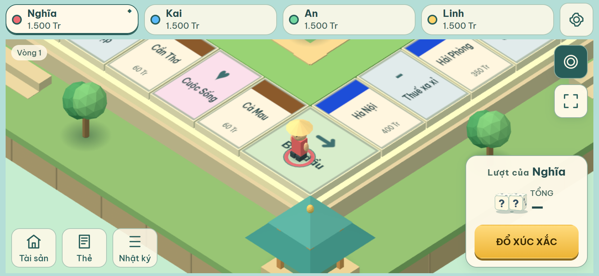

# Sửa nền đỡ bàn cờ — 2026-10-04

Theo phản hồi sau Task #4, góc Bắt đầu nhô khỏi nền do bàn cờ vuông 12,2 × 12,2 nhưng lớp viền đỡ vẫn là hình chữ nhật 12,4 × 10,45 của bản cũ. Các lớp bệ bên dưới cũng dùng hai kích thước khác nhau.

`BOARD_PLATFORM` trong `src/rendering/squareBoard.ts` lấy kích thước từ manifest bàn cờ: viền 12,4 × 12,4; bệ trên 12,55 × 12,55; đảo đá 15,3 × 15,3; viền cỏ 15,5 × 15,5; sân trong 8,95 × 8,95. Tất cả cùng tâm. Mặt trên viền đỡ chạm mặt dưới tile; đường ghép đá nằm sát mặt bệ theo kích thước thực tế.

Không thay đổi tọa độ/thứ tự 40 ô, luật chơi, store hoặc camera. Chỉ thay đổi hình học môi trường.

## Xác nhận

- `npm run check`: typecheck đạt, 96/96 tests đạt, build đạt.
- Regression test kiểm tra toàn bộ footprint của 40 ô nằm trong viền đỡ theo cả X/Z, các lớp bệ lồng nhau và sân trong vừa khoảng trống giữa bàn.
- `node scripts/task4-visual-check.mjs`: 14 nhóm kiểm tra, 9 viewport từ 568×320 đến 1440×900; không scroll trang, toàn bộ bàn vừa vùng camera, không page/console errors. Render-on-demand vẫn dừng khi idle, memory ổn định qua các chu kỳ fixture.
- Đã xem ảnh overview và follow tại cả bốn góc 0/10/20/30. Ảnh after trong `task4-visual-comparison.html` đã cập nhật; ảnh before giữ nguyên.
- Overview cùng fixture vẫn là 116 draw calls / 7262 triangles; không thêm mesh hoặc material cho bản sửa.

Các viewport kiểm tra qua Chrome headless; chưa xác nhận trên thiết bị điện thoại thật.

Ảnh các góc còn lại: `task4-platform-corner-10-mobile.png`, `task4-platform-corner-20-mobile.png`, `task4-platform-corner-30-mobile.png`. Kết quả máy đọc được: `task4-visual-checks.json`.
